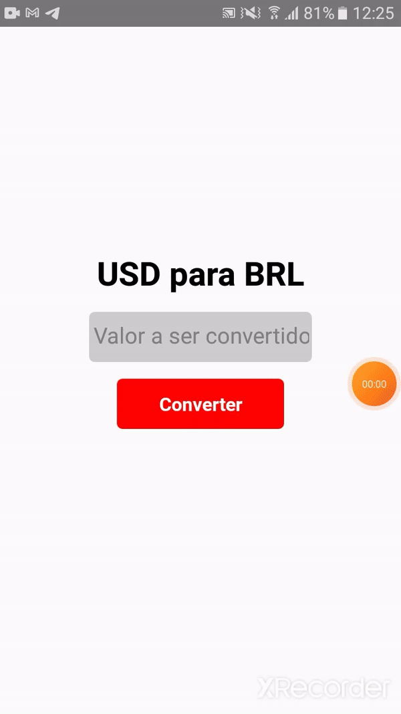
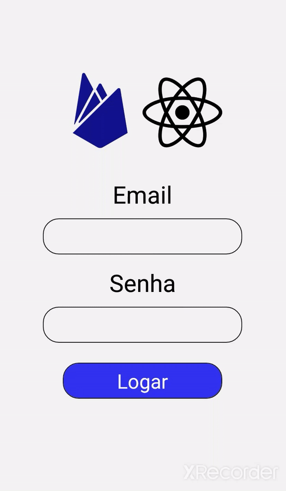

# React_Apps

## Descrição

Repositório destinado a guardar/mostrar aplicativos feitos em React-Native durante o curso _Aprenda criar aplicativos nativos para Android e IOS do zero ao avançado usando JavaScript por Matheus Fraga_

## Aplicativos já feitos

1. Biscoito da sorte
2. Cronomêtro
3. BancoReact
4. Instagram
5. Conversor de Moedas
6. Buscador de CEP
7. FirebaseApp
8. Tarefas

## Lembrete

- Design não está responsivo!

### Detalhes dos Aplicativos

1. Biscoito da sorte

   Que tal quebrar o biscoito e receber aquelas frazes inspiradoras? com este app você pode fazer isso a qualquer moemento.

   Este aplicativo mostra como usar imagens, botões, funções e um pouco de array.

   

2. Cronomêtro

   Um cronomêtro bem legal e simples.

   Neste projeto ja conseguimos entender um pouco mais da estrutura e complexidade da linguagem bem como suas possiblidades.

   

3. BancoReact

   Um formulário feito em React Native visando cadastrar informações básicas de uma conta bancaria.

   O usuário insere as informações e quando clica no botão, elas aparecerão em um alert.

   O intuito deste projeto foi aprender a utilizar Slider, Picker e Swicth.

   

4. Instagram

   Simulando uma interface básica do instagram

   

5. Conversor de Moedas

   Quer saber quanto ta o dolar neste momento? Este app é perfeito para isso.

   Usando a api Free Currency Convert, conseguimos converter Dolar para real em segundos!

   

6. Buscador de CEP

   Quer saber o endereço de um determinado CEP?

   Usando a api ViaCep, conseguimos consultar qualquer CEP no país!

   Com ele conseguimos saber qual a Cidade, Estado, o Nome da Rua e o Bairro!

   

7. FirebaseApp

   Um aplicativo de login que utiliza o firebase.

   Implementando firebase, navigation e icons para melhor experiência.

   Obs: para funcionar coloque sua api key no arquivo firebaseConnection, está sem por razões óbvias.

   

8. Tarefas

   Um app fácil e rápido para guardar tarefas do dia a dia.

   Usando como banco o firebase, guardamos todas as tarefas.

   Também existe a opção de apagar e editar a tarefa!

   Obs: para funcionar coloque sua api key no arquivo firebaseConnection, está sem por razões óbvias.

   
