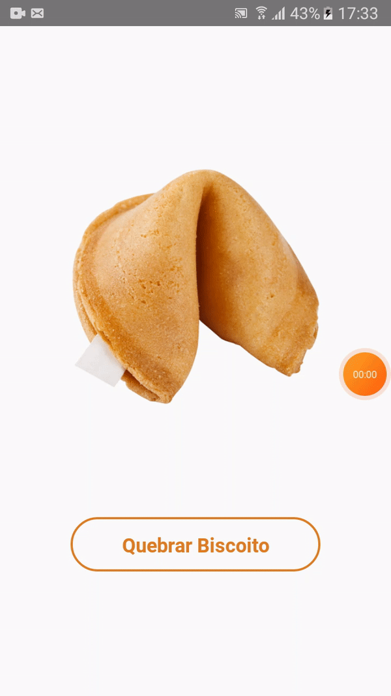
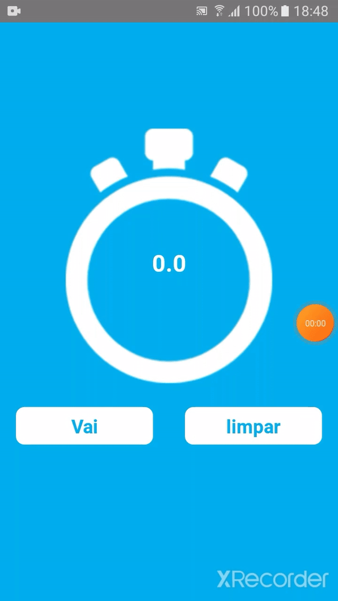

# React_Apps

## Descrição

Repositório destinado a guardar/mostrar aplicativos feitos em React-Native durante o curso _Aprenda criar aplicativos nativos para Android e IOS do zero ao avançado usando JavaScript por Matheus Fraga_

## Aplicativos já feitos

1. Biscoito da sorte
2. Cronomêtro

## Lembrete

- Design não está responsivo!

### Detalhes dos Aplicativos

1. Biscoito da sorte

   Que tal quebrar o biscoito e receber aquelas frazes inspiradoras? com este app você pode fazer isso a qualquer moemento.

   Este aplicativo mostra como usar imagens, botões, funções e um pouco de array.

   

2. Cronomêtro

   Não tem muito o que dizer sobre este, é um cronomêtro simples e funcional.

   Neste projeto ja conseguimos entender um pouco mais da estrutura e complexidade da linguagem bem como suas possiblidades.

   

3. BancoReact

   Um formulário feito em React Native visando cadastrar informações básicas de uma conta bancaria.

   O usuário insere as informações e quando clica no botão, elas aparecerão em um alert.

   O intuito deste projeto foi aprender a utilizar Slider, Picker e Swicth.

   

4. Instagram

   Simulando uma interface básica do instagram

   
